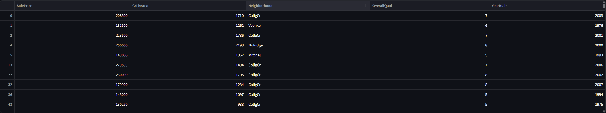
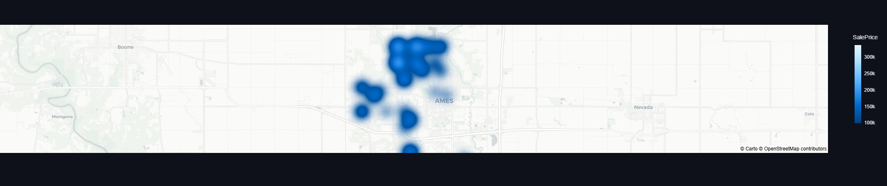
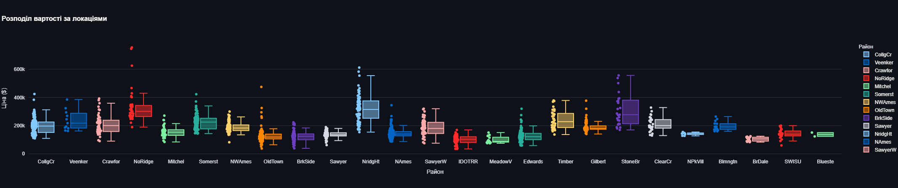

# Real Estate Market Analysis 🏠

## 📋 Огляд проекту
Цей проект присвячений аналізу факторів, що впливають на вартість житла. Мета — надати інструмент для швидкої візуалізації зв'язку між ціною, площею та якістю будинків у різних районах міста Еймс, штату Айова, США.

## 🛠 Проведена робота
В ході виконання проекту було реалізовано наступне:

Збір даних (Collect Data):

Використано бібліотеку Scikit-Learn для програмного завантаження Ames Housing Dataset безпосередньо в середовищі DataLab: 🔗 https://www.datacamp.com/datalab/w/5660a3b9-6444-45cc-920c-ada99f79d31b/edit

Очищення даних (Clean Data):

Відібрано найбільш релевантні ознаки (SalePrice, GrLivArea, Neighborhood, OverallQual, YearBuilt).



Видалено пропущені значення та відкориговано типи даних.

Дані збережено у компактний формат CSV для оптимізації швидкості роботи додатка.

Реалізовано статистичну теплову карту для виявлення найбільш значущих факторів впливу на вартість об'єктів.

Розробка дашборду (Present Findings): 

Створено інтерактивний інтерфейс на Streamlit з фільтрацією за районами та роком забудови.

## 📊 Основні висновки (Insights)
Кореляція ціни та площі: Спостерігається чітка лінійна залежність — чим більша житлова площа (GrLivArea), тим вища ціна продажу.

Вплив якості: Будинки з високим показником OverallQual (загальна якість) мають значно вищу ціну навіть при аналогічній площі.

Територіальний фактор: Найвищі ціни на нерухомість зафіксовані в районах, побудованих після 2000-х років.

## 🚀 Як запустити
Локально:

Клонуйте репозиторій: git clone https://github.com/Okhra83/real-estate-market-analysis.git

Встановіть необхідні бібліотеки: pip install -r requirements.txt

Запустіть сервер Streamlit: streamlit run app.py

Хмарні сервіси:

Демо-версія проекту на Streamlit: 🔗 https://real-estate-market-analysis-49dub7safnm3eraopw9zuu.streamlit.app/






## 🧪 Викоритсані інструменти
Мова: Python 3.x

Аналіз: Pandas, Scikit-learn

Візуалізація: Plotly Express

Деплой: Streamlit Cloud

## 📂 Структура проекту
```text
real-estate-market-analysis/
├── data/
│   └── cleaned_real-estate-market-analysis.csv  # Очищені та підготовлені дані
├── app.py                                       # Код додатка Streamlit
├── requirements.txt                             # Залежності проекту
└── README.md                                    # Документація проекту
